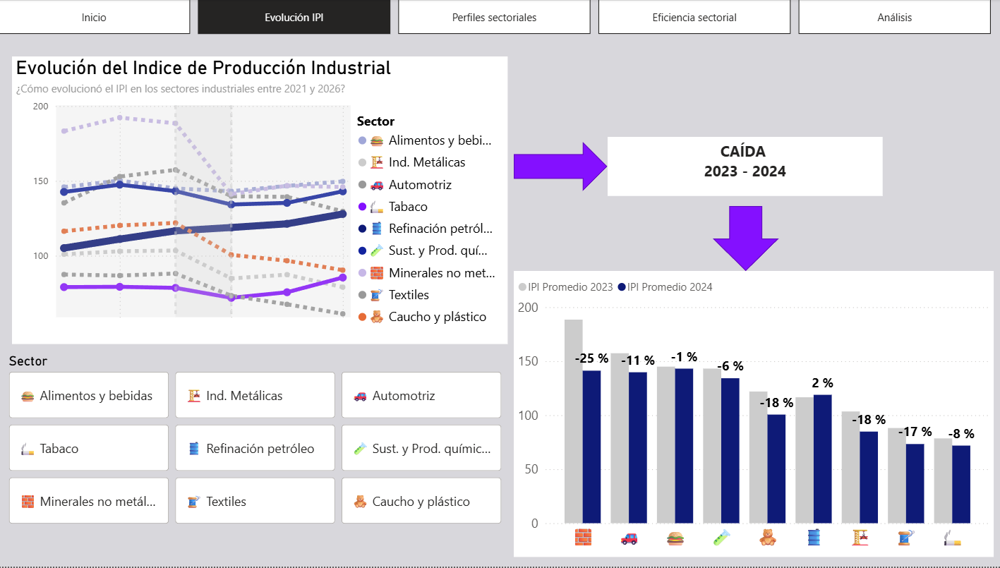
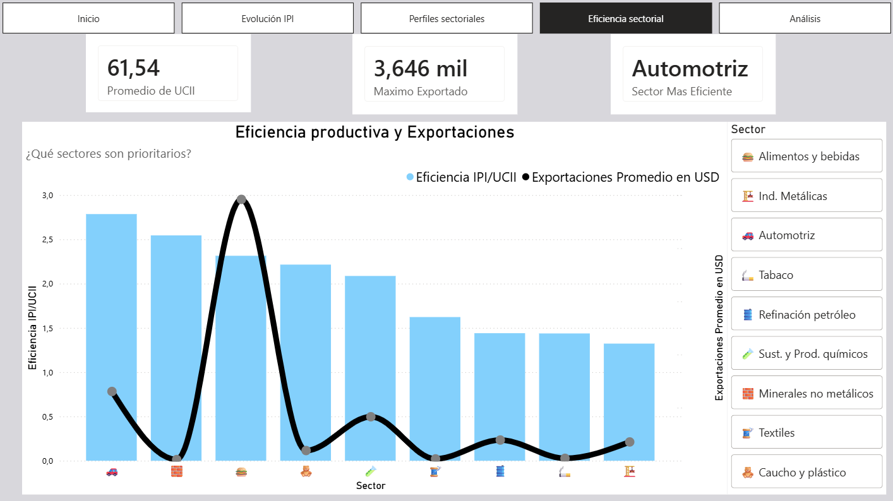
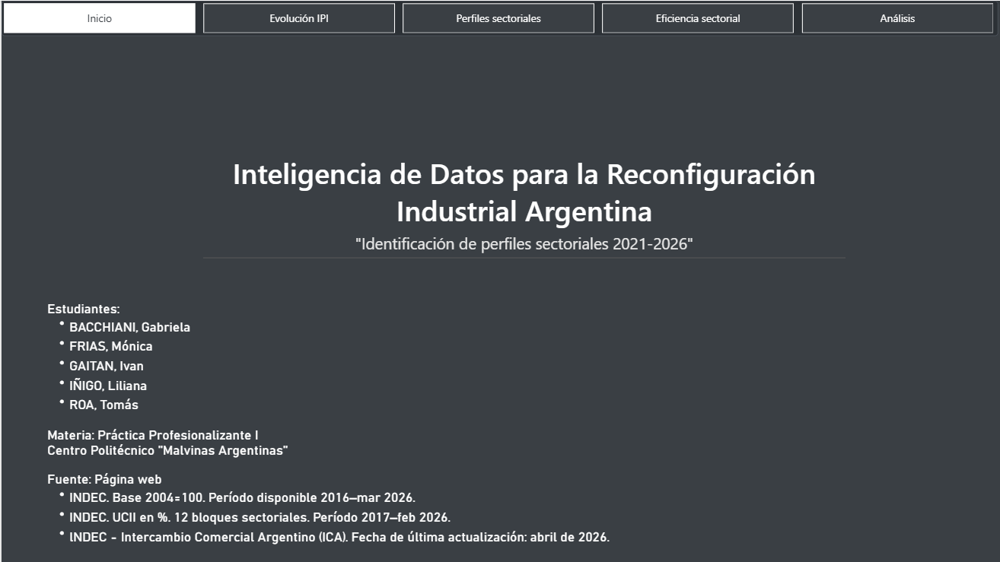
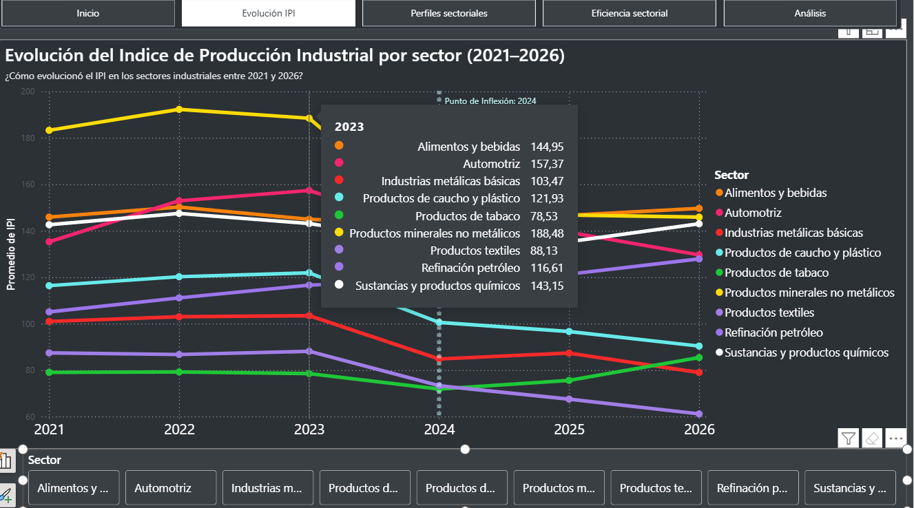
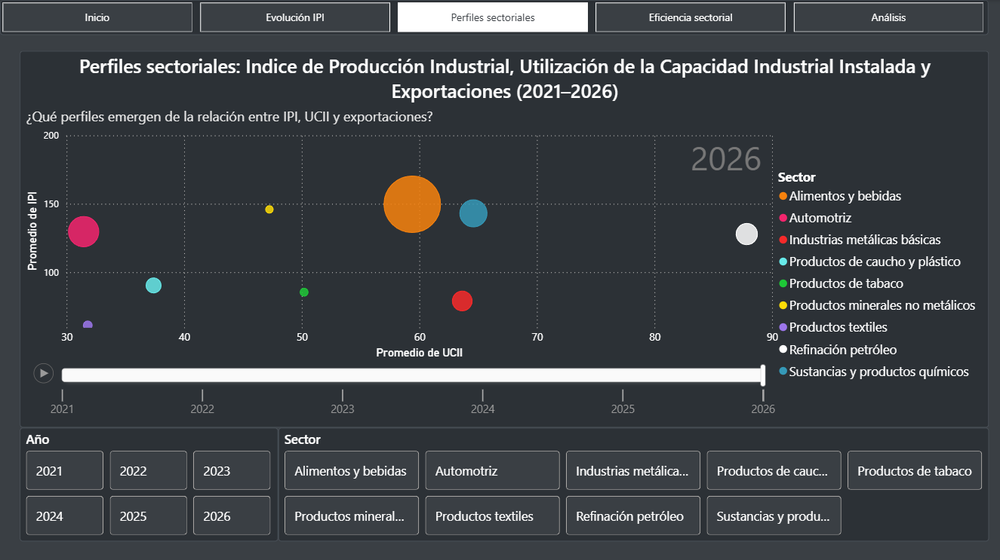

<div align="center">


<h1>Inteligencia de Datos para la Reconfiguración Industrial Argentina</h1>

<p><strong>Eficiencia productiva y perfiles sectoriales en la industria manufacturera · 2021–2026</strong></p>

<p>
Tecnicatura Superior en Ciencia de Datos e Inteligencia Artificial<br>
Politécnico Malvinas Argentinas — Práctica Profesionalizante I · 1.<sup>er</sup> Cuatrimestre 2026
</p>

<p>
<a href="https://drive.google.com/file/d/11bICz3zygWCJwADbQUcbw9rP9vB-IerD/view?usp=sharing"></a>
</p>

<p>


</p>

</div>

---

## Integrantes del equipo

- Bacchiani, Gabriela
- Frías, Mónica
- Gaitán, Iván Darío
- Iñigo, Liliana
- Roa Gunn, Tomás

**Docentes:** Martín Mirabete · Silvana Páez Jiménez · Federico Magaldi *(coordinador de la Práctica Profesionalizante)*

---

## Descripción del proyecto

La industria manufacturera argentina atraviesa una reconfiguración estructural posterior a la pandemia, marcada por una fuerte heterogeneidad: algunos sectores operan cerca de su capacidad máxima mientras otros tienen más del 40% de su infraestructura sin usar. Este proyecto aplica inteligencia de datos sobre registros oficiales del INDEC —el Índice de Producción Industrial (IPI) y la Utilización de la Capacidad Instalada Industrial (UCII)— para diagnosticar esa heterogeneidad en el período 2021–2026 y aportar evidencia empírica para la reconfiguración del sector.

El objetivo es identificar y caracterizar perfiles de eficiencia sectorial cruzando producción (IPI), uso de capacidad (UCII) y exportaciones. Del análisis emergen tres perfiles: un bloque motor de alta producción y exportaciones (Alimentos y Bebidas, Automotriz, Químicos), un caso de uso intensivo de capacidad con fuerte aporte exportador pero límite físico de producción (Refinación de Petróleo), y un grupo de ramas rezagadas con registros bajos en todas las variables (Textiles, Tabaco, Caucho y Plástico).

---

## 🎥 Video de presentación

Presentación académica del proyecto (Sprint 3), donde el equipo recorre el problema, el análisis y el dashboard final.

▶️ **[Ver el video de presentación](https://drive.google.com/file/d/11bICz3zygWCJwADbQUcbw9rP9vB-IerD/view?usp=sharing)**

> El video (≈ 288 MB) se aloja en Google Drive por superar el límite de tamaño de GitHub.

---

## Fuente de datos

| Dataset | Fuente | Período | Frecuencia |
|---|---|---|---|
| IPI Manufacturero (`sh_ipi_manufacturero_2026.xls`) | INDEC | Ene 2016 – Mar 2026 | Mensual |
| UCII (`sh_capacidad_04_26.xls`) | INDEC | Ene 2017 – Feb 2026 | Mensual |
| Complejos exportadores (`complejos_exportadores_serie_2002_2025.xlsx`) | INDEC / ICA | 2002 – 2025 | Anual |
| Exportaciones por categoría ICA (`exportaciones-mensual.csv`) | INDEC (ICA) | Ene 1992 – Abr 2026 | Mensual |
| Exportaciones por rama de actividad (`total_expo_total_empresas_por_clae3.csv`) | INDEC / datos.gob.ar | Ene 2007 – Nov 2023 | Mensual (CLAE3) |

Todos los datasets son de acceso público. El IPI usa base 2004 = 100. La UCII se expresa en porcentaje; su complemento (100 − UCII) representa la capacidad ociosa. Las exportaciones están en millones de USD FOB.

---

## Objetivos del análisis

- Comparar la producción real (IPI) contra el uso de capacidad instalada (UCII) por sector para el período 2021–2026.
- Identificar perfiles sectoriales según su posición en la matriz IPI × UCII.
- Analizar la evolución temporal de cada sector y detectar puntos de inflexión.
- Incorporar las exportaciones como variable que valida la competitividad externa de cada perfil.

---

## Preguntas de análisis

El análisis se estructura en torno a tres preguntas centrales (ver `reports/sprint_2/PP1-S2-FICHA ANÁLISIS DATOS.docx`):

1. **¿Cómo evolucionó el Índice de Producción Industrial (IPI) en los distintos sectores industriales argentinos entre 2021 y 2026?**
2. **¿Qué perfiles de comportamiento productivo emergen de la relación entre el IPI, la UCII y las exportaciones durante el período 2021–2026?**
3. **¿Qué sectores presentan altos niveles de eficiencia productiva (IPI/UCII) con un desempeño sólido en exportaciones, y por qué serían prioritarios para la reconfiguración industrial argentina?**

---

## Herramientas utilizadas

- **Power BI** — ETL (Power Query) y visualizaciones
- **Excel** — revisión y exploración inicial de los datasets
- **Google Drive** — almacenamiento principal de archivos de trabajo
- **Trello** — gestión de tareas por sprint
- **GitHub** — repositorio del proyecto

---

## Proceso de análisis

**Exploración inicial (Sprint 1)**  
Se analizó la estructura de los datasets: filas, columnas, tipos de dato, valores nulos y problemas de formato. El IPI tiene ~85 subclases CLaNAE y la UCII reporta 12 bloques sectoriales, por lo que no hay correspondencia directa 1 a 1 entre ambos. Se construyó una tabla de equivalencias para normalizar los nombres entre los tres datasets y trabajar con 9 sectores comparables.

**Limpieza y normalización (Sprint 2)**  
Se procesaron los dos datasets principales en Power Query: se resolvió el encabezado de dos niveles del IPI, se completó el campo año (que venía vacío en los meses que no eran enero), se marcaron los datos provisionales de los últimos meses y se homogeneizaron los nombres de sectores. El dataset de exportaciones se está incorporando en esta misma etapa.

**Visualizaciones**  
Se desarrollaron en Power BI: scatter de posicionamiento sectorial (IPI vs UCII), gráfico de barras apiladas de capacidad utilizada vs ociosa, y líneas de evolución temporal por sector.

**Consolidación y cierre (Sprint 3)**  
Se consolidan los insights y las visualizaciones en el dashboard final de Power BI, se redacta el informe técnico final y se deja el repositorio actualizado con la estructura definitiva: datasets, modelo `.pbix`, documentación y entregables de los tres sprints.

---

## Resultados principales

- El promedio de utilización de capacidad instalada de la industria en el período es de ≈ **61,5%**, lo que implica cerca de un **38,5% de capacidad ociosa** promedio.
- La industria muestra un perfil **heterogéneo y polarizado**: sectores líderes claramente diferenciados de un grupo de ramas rezagadas.
- **Alimentos y Bebidas** es el sector preponderante: el más resiliente ante la caída de 2024, el de mayor eficiencia productiva relativa y el principal generador de divisas.
- **Sustancias y Productos Químicos** y **Automotriz** funcionan como motores secundarios de alta eficiencia y con un aporte exportador robusto.
- **Refinación de Petróleo** registra la **UCII más alta del panel (≈ 78,39%)** y crecimiento sostenido post-2024, pero baja eficiencia técnica: al operar al límite de su capacidad, requeriría inversión en ampliación para crecer en producción.
- **Productos Textiles**, **Tabaco** y **Caucho y Plástico** son los sectores rezagados, con los valores más bajos en producción, capacidad utilizada y exportaciones.
- Entre **2023 y 2024** la industria sufrió una recesión generalizada: el IPI promedio cayó con fuerza en **Caucho y Plástico (−18 %)**, **Textil (−17 %)** y **Automotriz (−11 %)**, tras el pico de 2022–2023 y con recuperación dispar entre sectores.

---

## 🔑 Hallazgos clave

Tres hallazgos sintetizan el análisis (son los que estructuran el video de presentación).

**Contexto — la recesión 2023–2024.** En ese bienio la industria sufrió una contracción generalizada del IPI: **Caucho y Plástico −18 %**, **Textil −17 %** y **Automotriz −11 %**.

### 🛢️ Hallazgo 1 — Un único sector inmune a la caída
**Refinación de Petróleo** fue el único rubro que no solo resistió, sino que *creció* (**+2 % de IPI**) mientras el resto del aparato productivo se contraía. El sector energético tiene dinámicas de demanda propias, capaces de aislarse de las crisis del consumo interno.

### 🏭 Hallazgo 2 — Tres perfiles industriales
Cruzando producción, uso de capacidad y exportaciones emergen tres perfiles bien diferenciados:

| Perfil | Sectores | IPI | UCII | Exportaciones |
|---|---|:---:|:---:|:---:|
| **Sectores motores** | Alimentos y Bebidas · Automotriz · Productos Químicos | Alto | Media | Fuertes a moderadas |
| **La excepción energética** | Refinación de Petróleo | Estable | Máxima (techo técnico) | Importantes |
| **Sectores rezagados** | Textil · Tabaco · Caucho y Plástico | Bajo | Baja | Muy bajas |

### 🚀 Hallazgo 3 — Potencialidad de cada sector
Con una nueva variable, la **eficiencia productiva (IPI / UCII)**, cruzada con las exportaciones, se proyecta el potencial de cada perfil:

- **Motores potenciales:** alto potencial de crecimiento productivo y exportador.
- **Disociación operativa (Refinación de Petróleo):** produce al máximo de su capacidad; no puede crecer sin fuertes inversiones de infraestructura, pero sostiene exportaciones clave.
- **Sectores rezagados:** sin proyección de crecimiento inmediata; requieren medidas específicas para revertir su rezago.

---

## Visualizaciones

Cada visualización responde a una de las tres preguntas de análisis.

### Pregunta 1 — Evolución del IPI por sector (2021–2026)
Gráfico de líneas de la evolución temporal del IPI por sector.



**Qué se observa:** crecimiento desde 2021 hasta un pico en 2022–2023 y una caída generalizada en 2024. *Alimentos y Bebidas* se mantiene alto y estable (mayor resiliencia); *Automotriz* cae con fuerza en 2024 sin recuperación visible; *Textiles* e *Industrias Metálicas Básicas* muestran caída pronunciada con recuperación parcial; *Refinación de Petróleo* es la única excepción, con crecimiento sostenido hacia 2026.

### Pregunta 2 — Perfiles productivos (IPI × UCII × exportaciones)
Distribución bivariada y segmentación de los sectores según producción, uso de capacidad y exportaciones.


**Qué se observa:** emergen tres perfiles. (1) Alta producción, capacidad media-alta (UCII 50–70%) y exportaciones fuertes a moderadas: *Alimentos y Bebidas, Automotriz, Productos Químicos*. (2) Uso intensivo de capacidad con buenas exportaciones: *Refinación de Petróleo* (UCII máxima del panel). (3) Sectores rezagados con valores bajos en todas las variables, agrupados en el cuadrante inferior izquierdo: *Productos Textiles, Tabaco y Caucho y Plástico*.

### Pregunta 3 — Eficiencia productiva (IPI/UCII) y exportaciones
Gráfico combinado (columnas agrupadas de eficiencia + línea de exportaciones).



**Qué se observa:** *Alimentos y Bebidas* lidera, con la mayor eficiencia relativa y el mayor nivel de exportaciones. *Sustancias y Productos Químicos* y *Automotriz* aparecen como motores secundarios, altamente competitivos. *Refinación de Petróleo* es un caso de desconexión: buen desempeño exportador pero baja eficiencia técnica, porque consume casi toda su capacidad instalada (UCII ≈ 78,39%). *Textiles, Tabaco y Caucho y Plástico* quedan en los últimos lugares en eficiencia y con participación marginal en el comercio exterior.

---

## Dashboard final (Sprint 3)

El cierre del proyecto se materializa en un dashboard interactivo de Power BI (`analysis/pbix/SPRINT 3.pbix`) que integra las tres preguntas de análisis en páginas navegables. El paso a paso para usarlo está en `docs/Manual_Usuario_Dashboard_Sprint3.docx`.

| Página de inicio | Evolución del IPI |
|---|---|
|  |  |

| Eficiencia sectorial | Perfiles sectoriales |
|---|---|
|  |  |

> El resto de las capturas y las animaciones del recorrido están en `docs/capturas/dashboard_sprint_3/`.

---

## Conclusiones

Los datos del INDEC confirman una industria manufacturera **heterogénea y polarizada**. **Alimentos y Bebidas** lidera la estructura como el bloque más resiliente, eficiente y generador de divisas; **Químicos** y **Automotriz** operan como motores industriales secundarios de alta eficiencia. En el extremo opuesto, las ramas ligadas al consumo interno (**Textil, Tabaco, Caucho y Plástico**) muestran un estancamiento crítico generalizado en producción, uso de capacidad e inserción externa entre 2021 y 2026.

**Refinación de Petróleo** cumple un rol clave pero atípico: no como motor flexible de alta producción, sino como estabilizador de energía y divisas. Su baja eficiencia técnica se explica porque consume casi toda su capacidad instalada (UCII máxima del panel, 78,39%); para aumentar su producción física necesitaría inversiones de ampliación en sus plantas.

El Sprint 3 consolida estos hallazgos en el informe técnico final y el dashboard, y deja el repositorio con la estructura definitiva del proyecto.

<p align="center"><em>"Los datos no solo cuentan lo que pasó — nos muestran hacia dónde ir."</em></p>

---

## Estructura del repositorio

```
├── README.md
├── assets/
│   └── portada.png       ← imagen de portada del proyecto
├── data/
│   ├── raw/              ← datasets originales (INDEC: IPI, UCII, exportaciones)
│   └── processed/        ← datos transformados exportados desde Power Query
├── analysis/
│   └── pbix/             ← archivos .pbix con el modelo y las visualizaciones
├── docs/
│   ├── capturas/         ← imágenes de los gráficos
│   │   └── dashboard_sprint_3/   ← capturas y animaciones del dashboard final
│   ├── etl/              ← controles de limpieza y registro de errores
│   ├── organizacion/     ← gantt, roles y minutas por sprint
│   ├── Diccionario de Datos.docx
│   ├── Manual_Usuario_Dashboard_Sprint3.docx   ← manual de uso del dashboard
│   ├── PP1-PLA-S1-DiccionarioDatos Equipo 3.xlsx   ← diccionario de datos final
│   └── Criterios para la NORMALIZACIÓN DE INDUSTRIAS POR SECTOR.xlsx
└── reports/             ← informes técnicos y entregables por sprint
    ├── sprint_1/
    ├── sprint_2/
    └── sprint_3/
```

> Los archivos de mayor tamaño (.pbix, .xls) se mantienen también en Google Drive como respaldo principal.

---

<div align="center">

**Equipo N.º 3** · Bacchiani · Frías · Gaitán · Iñigo · Roa Gunn
<br>
Politécnico Malvinas Argentinas · Tecnicatura en Ciencia de Datos e Inteligencia Artificial · 2026

</div>
