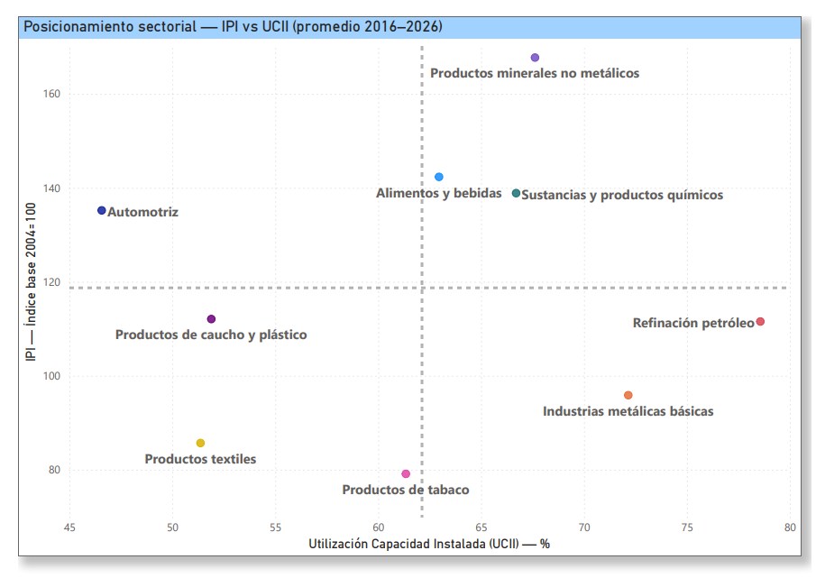
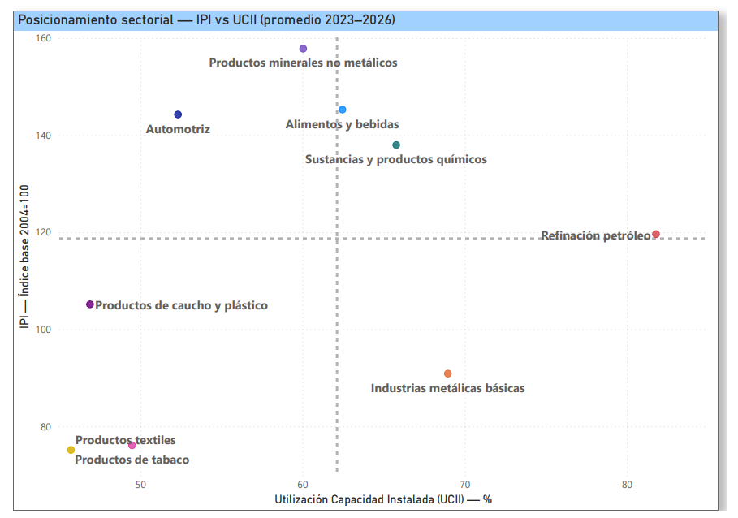

# Eficiencia productiva y capacidad ociosa en la industria manufacturera argentina
### Identificación de perfiles sectoriales 2021–2026

Tecnicatura Superior en Ciencia de Datos e Inteligencia Artificial  
Politécnico Malvinas Argentinas — Práctica Profesionalizante I · 1C 2026

---

## Integrantes del equipo

- Bacchiani, Gabriela
- Frías, Mónica
- Gaitán, Iván Darío
- Iñigo, Liliana
- Roa Gunn, Tomás

---

## Descripción del proyecto

La industria manufacturera argentina no es homogénea: algunos sectores operan cerca de su capacidad máxima mientras otros tienen más del 40% de su infraestructura sin usar. Este proyecto analiza esa brecha a partir de dos indicadores oficiales del INDEC —el Índice de Producción Industrial (IPI) y la Utilización de la Capacidad Instalada Industrial (UCII)— para el período 2021–2026.

El objetivo es identificar perfiles de comportamiento sectorial: qué sectores producen mucho y usan bien su capacidad, cuáles tienen alta ocupación pero baja producción, y cuáles están rezagados en ambas dimensiones. Como complemento, se incorpora el dataset de exportaciones por complejo industrial para validar si los sectores más eficientes también son los más orientados al mercado externo.

---

## Fuente de datos

| Dataset | Fuente | Período | Frecuencia |
|---|---|---|---|
| IPI Manufacturero (`sh_ipi_manufacturero_2026.xls`) | INDEC | Ene 2016 – Mar 2026 | Mensual |
| UCII (`sh_capacidad_04_26.xls`) | INDEC | Ene 2017 – Feb 2026 | Mensual |
| Complejos exportadores (`complejos_exportadores_serie_2002_2025.xlsx`) | INDEC / ICA | 2002 – 2025 | Anual |
| Exportaciones por categoría ICA (`exportaciones-mensual.csv`) | INDEC (ICA) | Ene 1992 – Abr 2026 | Mensual |
| Exportaciones por rama de actividad (`total_expo_total_empresas_por_clae3.csv`) | INDEC / datos.gob.ar | Ene 2007 – Nov 2023 | Mensual (CLAE3) |

Todos los datasets son de acceso público. El IPI usa base 2004 = 100. La UCII se expresa en porcentaje; su complemento (100 − UCII) representa la capacidad ociosa. Las exportaciones están en millones de USD FOB.

---

## Objetivos del análisis

- Comparar la producción real (IPI) contra el uso de capacidad instalada (UCII) por sector para el período 2021–2026.
- Identificar perfiles sectoriales según su posición en la matriz IPI × UCII.
- Analizar la evolución temporal de cada sector y detectar puntos de inflexión.
- Incorporar las exportaciones como variable que valida la competitividad externa de cada perfil.

---

## Herramientas utilizadas

- **Power BI** — ETL (Power Query) y visualizaciones
- **Excel** — revisión y exploración inicial de los datasets
- **Google Drive** — almacenamiento principal de archivos de trabajo
- **Trello** — gestión de tareas por sprint
- **GitHub** — repositorio del proyecto

---

## Proceso de análisis

**Exploración inicial (Sprint 1)**  
Se analizó la estructura de los datasets: filas, columnas, tipos de dato, valores nulos y problemas de formato. El IPI tiene ~85 subclases CLaNAE y la UCII reporta 12 bloques sectoriales, por lo que no hay correspondencia directa 1 a 1 entre ambos. Se construyó una tabla de equivalencias para normalizar los nombres entre los tres datasets y trabajar con 9 sectores comparables.

**Limpieza y normalización (Sprint 2)**  
Se procesaron los dos datasets principales en Power Query: se resolvió el encabezado de dos niveles del IPI, se completó el campo año (que venía vacío en los meses que no eran enero), se marcaron los datos provisionales de los últimos meses y se homogeneizaron los nombres de sectores. El dataset de exportaciones se está incorporando en esta misma etapa.

**Visualizaciones**  
Se desarrollaron en Power BI: scatter de posicionamiento sectorial (IPI vs UCII), gráfico de barras apiladas de capacidad utilizada vs ociosa, y líneas de evolución temporal por sector.

**Consolidación y cierre (Sprint 3)**  
Se consolidan los insights y las visualizaciones en el dashboard final de Power BI, se redacta el informe técnico final y se deja el repositorio actualizado con la estructura definitiva: datasets, modelo `.pbix`, documentación y entregables de los tres sprints.

---

## Resultados principales

- El promedio de utilización de capacidad instalada de toda la industria para el período es de **61,5%**, lo que implica que cerca del 38,5% queda ocioso en promedio.
- **Refinación de petróleo** lidera en UCII (≈80%) impulsado por la expansión de Vaca Muerta, pero su IPI no lidera el ranking productivo.
- **Automotriz** se posiciona con IPI alto y UCII moderada, lo que lo ubica como el sector con mejor relación producción/infraestructura utilizada.
- **Productos textiles** y **Productos de tabaco** presentan los valores más bajos en ambas variables.
- A partir de 2023–2024 se observa una caída generalizada en IPI y UCII en casi todos los sectores.

---

## Visualizaciones

**Scatter IPI vs UCII — Promedio 2016–2026**  


**Scatter IPI vs UCII — Promedio 2023–2026**  


---

## Conclusiones

Los datos del INDEC muestran una industria con perfiles bien diferenciados. Los sectores vinculados a la demanda externa (petróleo, alimentos, químicos) operan con mayor uso de infraestructura, mientras los orientados al mercado interno (textiles, tabaco) muestran la mayor capacidad ociosa. La caída de 2023–2024 es transversal y afecta tanto a los indicadores de producción como a los de utilización de capacidad.

El Sprint 3 avanzará hacia una segmentación más formal de estos perfiles.

---

## Estructura del repositorio

```
├── README.md
├── data/
│   ├── raw/              ← datasets originales (INDEC: IPI, UCII, exportaciones)
│   └── processed/        ← datos transformados exportados desde Power Query
├── analysis/
│   └── pbix/             ← archivos .pbix con el modelo y las visualizaciones
├── docs/
│   ├── capturas/         ← imágenes de los gráficos
│   ├── etl/              ← controles de limpieza y registro de errores
│   ├── organizacion/     ← gantt, roles y minutas por sprint
│   ├── Diccionario de Datos.docx
│   ├── PP1-PLA-S1-DiccionarioDatos Equipo 3.xlsx   ← diccionario de datos final
│   └── Criterios para la NORMALIZACIÓN DE INDUSTRIAS POR SECTOR.xlsx
└── reports/             ← informes técnicos y entregables por sprint
    ├── sprint_1/
    ├── sprint_2/
    └── sprint_3/
```

> Los archivos de mayor tamaño (.pbix, .xls) se mantienen también en Google Drive como respaldo principal.
